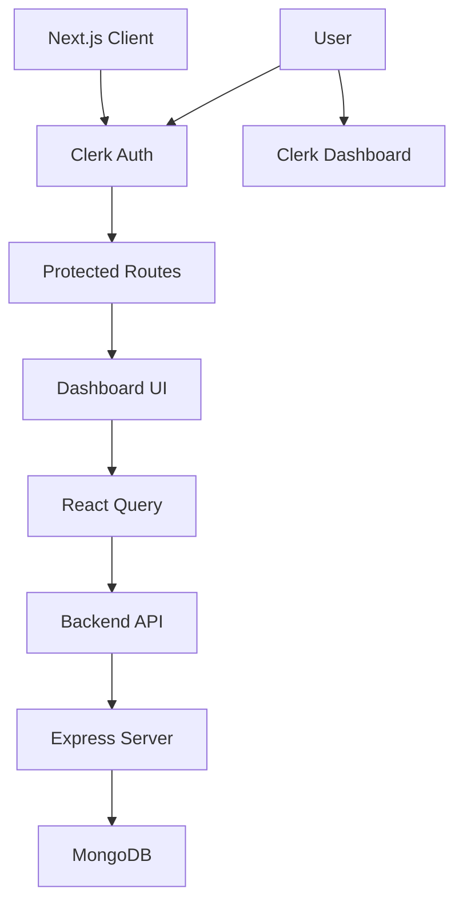
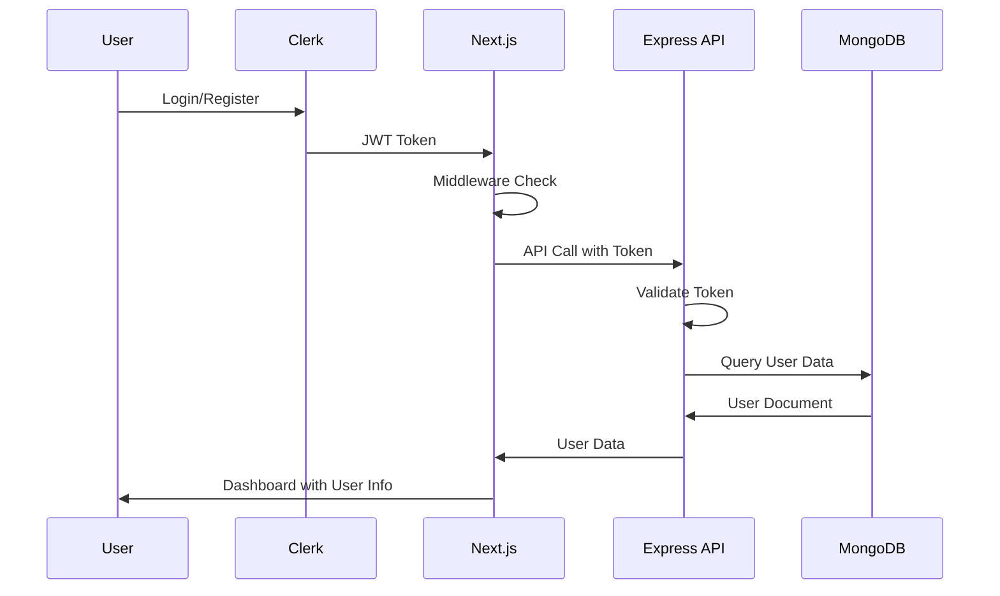
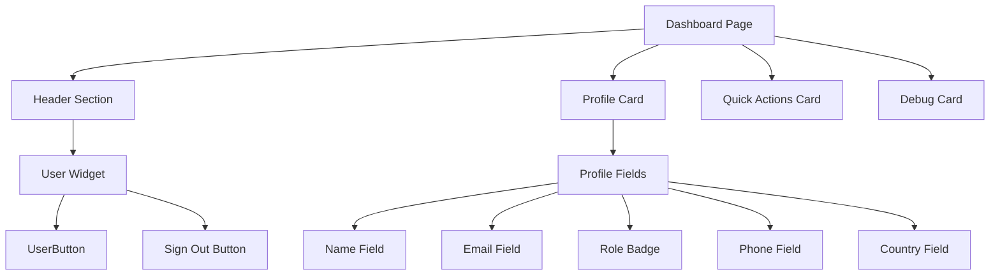
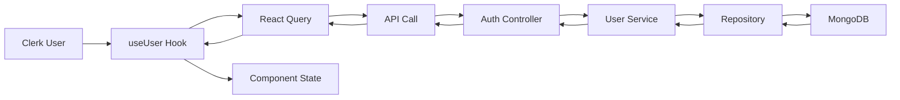

# BagXtra Phase 3 Implementation Documentation

## Overview

This document provides a comprehensive technical overview of the BagXtra platform's Phase 3 implementation, focusing exclusively on features, components, logic, and architecture that have been actually built and deployed. Phase 3 centered on Dashboard UI Development for the peer-to-peer logistics web application.

**Important Note:** This documentation reflects only what exists in the current codebase as of the end of Phase 3. Features mentioned in planning documents or future phases are not included, even if models or placeholders exist.

## Project Structure

### Client-Side Architecture (`/client`)

The client is built with Next.js 14, utilizing the App Router for routing and TypeScript for type safety.

```
client/
├── app/                          # Next.js App Router pages
│   ├── auth/                     # Authentication pages
│   │   ├── login/page.tsx        # Login page
│   │   ├── register/page.tsx     # Registration page
│   │   └── reset-password/       # Password reset page
│   ├── dashboard/page.tsx        # Main dashboard page
│   ├── layout.tsx                # Root layout with Clerk provider
│   ├── page.tsx                  # Landing page
│   └── globals.css               # Global Tailwind CSS styles
├── components/                   # Reusable UI components
│   ├── ui/                       # Shadcn/ui components
│   │   ├── alert.tsx
│   │   ├── badge.tsx
│   │   ├── button.tsx
│   │   ├── card.tsx
│   │   ├── input.tsx
│   │   ├── label.tsx
│   │   └── select.tsx
│   ├── QueryProvider.tsx         # React Query provider wrapper
│   └── auth-flow/                # Authentication flow components
│       ├── ProgressIndicator.tsx
│       └── RoleCard.tsx
├── hooks/                        # Custom React hooks
│   ├── useAuthFlow.ts
│   ├── useRole.ts
│   └── useUser.ts
├── lib/                          # Utility libraries
│   ├── auth/                     # Authentication utilities
│   │   ├── ProtectedRoute.tsx    # Route protection component
│   │   ├── rbac.ts               # Role-based access control
│   │   └── types.ts              # Authentication type definitions
│   ├── utils.ts                  # General utilities (cn function)
│   └── auth/types.ts             # Client-side auth types
├── middleware.ts                 # Next.js middleware for route protection
├── next.config.ts                # Next.js configuration
├── package.json                  # Dependencies and scripts
├── tailwind.config.ts            # Tailwind CSS configuration
├── tsconfig.json                 # TypeScript configuration
└── types/auth.ts                 # Additional auth types
```

### Server-Side Architecture (`/server`)

The server is built with Express.js and TypeScript, following a layered architecture with clear separation of concerns.

```
server/
├── src/
│   ├── controllers/              # Route handlers
│   │   └── authController.ts     # Authentication controllers
│   ├── middleware/               # Express middleware
│   │   ├── auth.ts               # Authentication middleware
│   │   ├── securityLogger.ts     # Security logging
│   │   └── validation.ts         # Request validation
│   ├── models/                   # Mongoose models
│   │   ├── BagItem.ts
│   │   ├── Match.ts
│   │   ├── Proof.ts
│   │   ├── ShopperRequest.ts
│   │   ├── Trip.ts
│   │   └── User.ts
│   ├── routes/                   # API route definitions
│   │   └── auth.ts               # Authentication routes
│   ├── services/                 # Business logic services
│   │   ├── BagService.ts
│   │   ├── DeliveryService.ts
│   │   ├── MatchingService.ts
│   │   ├── MatchService.ts
│   │   ├── PaymentService.ts
│   │   ├── ProofService.ts
│   │   ├── TripService.ts
│   │   ├── repositories.ts       # Repository interfaces
│   │   └── repositoryImpl.ts     # Repository implementations
│   ├── errors.ts                 # Custom error classes
│   └── server.ts                 # Express server setup
├── package.json                  # Dependencies and scripts
└── tsconfig.json                 # TypeScript configuration
```

## Dashboard UI Implementation

### Current Dashboard Layout

The dashboard is implemented as a single page at `/dashboard` that serves all authenticated users regardless of role. The layout consists of:

1. **Header Section**

   - Welcome message
   - User widget with Clerk UserButton and sign-out functionality
   - Responsive design with flex layout

2. **Profile Information Card**

   - Displays user details: full name, email, role badge, phone, country
   - Uses Shadcn/ui Card components with icons from Lucide React
   - Grid layout for responsive display

3. **Quick Actions Card**

   - Links to authentication flow pages for testing
   - Refresh profile functionality
   - Button components with outline variants

4. **Debug Information Card**
   - JSON display of user object for development purposes
   - Pre-formatted code block with syntax highlighting

### Implemented Components

#### UI Components (Shadcn/ui)

- **Button**: Used for actions, with variants (default, outline) and sizes
- **Card**: Container for dashboard sections with header, content, and description
- **Badge**: Displays user role with secondary variant
- **Alert**: Available but not used in current dashboard
- **Input/Label/Select**: Available but not used in current dashboard

#### Authentication Components

- **UserButton**: Clerk component for user menu and profile access
- **Protected Route Logic**: Implemented via Next.js middleware

### Responsive Design

The dashboard uses Tailwind CSS classes for responsive behavior:

- `min-h-screen`: Full viewport height
- `max-w-4xl mx-auto`: Centered container with max width
- `grid-cols-1 md:grid-cols-2`: Responsive grid for profile fields
- `flex flex-wrap gap-4`: Flexible button layout

## Authentication Pages and Flow

### Authentication Flow Components

#### RoleCard Component

Interactive card component for role selection during onboarding:

- **Visual Feedback**: Selection state with purple accent colors
- **Accessibility**: Full keyboard navigation and ARIA attributes
- **Animations**: Smooth hover and selection transitions
- **Icon Integration**: Lucide React icons for each role type
- **Selection Indicator**: Checkmark icon for selected state

#### ProgressIndicator Component

Visual progress indicator for multi-step authentication flow:

- **Animated Dots**: Dynamic sizing based on current step
- **Accessibility**: Screen reader support with progress values
- **Color Coding**: Completed (purple), active (purple), pending (light purple)
- **Responsive**: Adapts to different step counts

#### useAuthFlow Hook

Sophisticated state management for authentication flow:

- **Multi-Step Navigation**: Splash → Onboarding → Role Selection → Auth
- **Persistent State**: localStorage integration for role selection
- **Transition Management**: Smooth animations between screens
- **Computed Values**: Navigation logic and step tracking
- **Auto-Advance**: Automatic progression from splash screen

### Login Page Implementation

Comprehensive login page with advanced features:

- **Two-Column Layout**: Form on left, branded content on right
- **Already Signed In Handling**: Redirects authenticated users
- **Role Persistence**: Displays selected role from onboarding flow
- **Password Visibility Toggle**: Eye icon for password field
- **Form Validation**: Real-time error display
- **Responsive Design**: Mobile-optimized layout
- **Branded Content**: Marketing copy and contact information

### Registration Page Implementation

Multi-step registration with email verification:

- **Form Sections**: Personal info, account details, role selection
- **Email Verification**: Separate verification screen with code input
- **Password Strength Indicator**: Visual feedback with color coding
- **Role Pre-selection**: Integrates with onboarding flow
- **Form Validation**: Comprehensive client-side validation
- **Responsive Grid Layout**: Two-column form fields
- **Branded Two-Column Design**: Consistent with login page

### Authentication Flow Integration

- **localStorage Persistence**: Role selection maintained across sessions
- **Clerk Integration**: Seamless integration with Clerk authentication
- **Error Handling**: Comprehensive error states and user feedback
- **Loading States**: Proper loading indicators throughout flow
- **Navigation Guards**: Prevents access to auth pages when authenticated

## Authentication and Security

### Clerk Integration

- **Authentication Provider**: Clerk Next.js provider wraps the application in `layout.tsx`
- **Route Protection**: Middleware protects routes matching `/dashboard(.*)` and other protected paths
- **User Management**: Clerk handles user registration, login, and session management
- **JWT Tokens**: Integration with backend via token retrieval for API calls

### Backend Authentication

- **Auth Controller**: Handles user registration via Clerk webhooks, current user retrieval, profile updates
- **Middleware Stack**:
  - `requireAuth`: Validates JWT tokens from Clerk
  - `requireAdmin`: Role-based access for admin-only routes
  - `authorizeRoles`: Flexible role authorization
- **Validation**: Zod schemas for request validation and sanitization

### Role-Based Access Control (RBAC)

Comprehensive permission system for fine-grained access control:

- **Permission Definitions**: Resource-action pairs for all system features
- **Role Mappings**: Each role (shopper, traveler, vendor, admin) has specific permissions
- **Permission Checking**: Functions to verify permissions and access rights
- **Route Access Control**: Automatic route filtering based on user roles
- **Hierarchical Permissions**: Admin role inherits all other permissions

#### Permission Structure

```typescript
// Example permissions
USER_READ: { resource: 'user', action: 'read' }
SHOPPER_ORDERS_MANAGE: { resource: 'shopper', action: 'orders:manage' }
TRAVELER_TRIPS_MANAGE: { resource: 'traveler', action: 'trips:manage' }
ADMIN_USERS_READ: { resource: 'admin', action: 'users:read' }
```

#### Route Access by Role

- **Shopper**: `/dashboard`, `/orders`, `/requests`
- **Traveler**: `/trips`, `/offers` (plus shopper routes)
- **Vendor**: `/services`, `/vendor-orders` (plus shopper routes)
- **Admin**: All routes including `/admin/*`

### Security Measures

- **Protected Routes**: Dashboard and other sensitive routes require authentication
- **Token-Based API Access**: Backend APIs require valid JWT tokens
- **Input Validation**: All API endpoints use Zod validation
- **Data Sanitization**: Request bodies are sanitized before processing
- **Security Logging**: Middleware logs security events

## State Management and Data Fetching

### React Query Integration

- **QueryProvider**: Wraps the application to provide React Query context
- **Custom Hook (`useUser`)**: Fetches authenticated user data from backend API
  - Combines Clerk user data with backend user profile
  - Implements caching with 5-minute stale time and 10-minute garbage collection
  - Handles loading states and error conditions

### Data Flow Pattern

```
Clerk Auth → JWT Token → useUser Hook → React Query → Backend API (/api/auth/me) → User Data
```

### State Management Notes

- **No Zustand Stores**: Zustand is not implemented in the current codebase
- **Server State Only**: All state management is handled via React Query for server state
- **Local State**: Minimal local state used in components (loading, error states)

### Custom Hooks Implementation

#### useUser Hook

Primary hook for user authentication and data management:

- **Dual Data Sources**: Combines Clerk authentication with backend user profile
- **React Query Integration**: Caching, stale time management, error handling
- **Authentication State**: Provides loading, authenticated, and error states
- **JWT Token Handling**: Automatic token retrieval and API authentication

#### useRole Hook

Role-based access control utilities:

- **Role Checking**: Methods for checking specific roles and permissions
- **Feature Access**: Functions to determine feature availability by role
- **Admin/Vendor Logic**: Specialized checks for elevated permissions
- **Shopper/Traveler Access**: Role-based feature gating

#### useAuthFlow Hook

Complex state management for multi-step authentication:

- **Flow State**: Tracks current screen and user selections
- **Persistence**: localStorage integration for role selection
- **Navigation Logic**: Computed values for flow progression
- **Animation Control**: Transition state management
- **Auto-Advance**: Automatic progression for splash screens

## Styling and UI Framework

### Tailwind CSS

- **Configuration**: Standard Tailwind setup with custom utilities
- **Utility Classes**: Extensive use of Tailwind utilities for layout, spacing, and styling
- **Responsive Design**: Mobile-first approach with breakpoint prefixes (`md:`, `lg:`)

### Shadcn/ui Components

- **Component Library**: Pre-built accessible components
- **Customization**: Components use Tailwind CSS variables for theming
- **Accessibility**: Built-in ARIA attributes and keyboard navigation
- **TypeScript**: Fully typed components with proper interfaces

### Design System

- **Color Scheme**: Gray-based neutral colors with blue accents
- **Typography**: Default Tailwind typography scale
- **Spacing**: Consistent spacing using Tailwind spacing scale
- **Icons**: Lucide React icons integrated throughout the UI

## TypeScript Implementation

### Type Definitions

#### Client-Side Types (`client/lib/auth/types.ts`)

```typescript
export type UserRole = 'shopper' | 'traveler' | 'vendor' | 'admin';

export interface User {
  id: string;
  clerkId: string;
  fullName: string;
  email: string;
  role: UserRole;
  phone?: string;
  country?: string;
  profileImage?: string;
  createdAt?: string;
  updatedAt?: string;
}

export interface AuthContextType {
  user: User | null;
  isLoading: boolean;
  isAuthenticated: boolean;
  role: UserRole | null;
  // ... additional methods
}
```

#### Server-Side Types (`server/src/models/User.ts`)

```typescript
export type UserRole = 'shopper' | 'traveler' | 'vendor' | 'admin';

export interface IUser extends Document {
  _id: mongoose.Types.ObjectId;
  clerkId: string;
  fullName: string;
  email: string;
  role: UserRole;
  phone?: string;
  country?: string;
  profileImage?: string;
  rating?: number;
  maxRating?: number;
  createdAt: Date;
  updatedAt: Date;
}
```

### Type Safety Patterns

- **Interface Segregation**: Separate interfaces for client and server models
- **Enum Constants**: Runtime constants for role validation
- **Generic Types**: Reusable types for API responses and requests
- **Utility Types**: TypeScript utility types for optional and partial updates

## Architecture and Design Patterns

### Component Architecture

#### Atomic Design Principles (Partial Implementation)

- **Atoms**: Shadcn/ui components (Button, Input, Badge)
- **Molecules**: Card sections within dashboard
- **Organisms**: Complete dashboard page
- **Pages**: Route-level components

#### Component Composition

- **Layout Components**: Card-based layout with header/content structure
- **Functional Components**: Dashboard page with hooks integration
- **Provider Pattern**: QueryProvider for React Query context

### API Architecture

#### RESTful Routes

- **Authentication Routes**: `/api/auth/*` endpoints
- **Resource-Based**: Standard REST patterns for user management
- **Middleware Chain**: Validation → Authentication → Authorization → Handler

#### Service Layer Pattern

- **Service Classes**: Business logic separated from controllers
- **Repository Pattern**: Data access abstraction (interfaces and implementations)
- **Dependency Injection**: Services injected into controllers

### Security Architecture

#### Defense in Depth

- **Route Level**: Middleware protection
- **API Level**: Token validation and role checking
- **Data Level**: Input validation and sanitization
- **Logging**: Security event tracking

## System Architecture Diagrams

### High-Level System Architecture



### Authentication Flow



### Component Hierarchy



### Data Flow Architecture



## Pending Features (Phase 4 and Beyond)

The following features are planned but not yet implemented in the current codebase:

### Backend API Connections

- Business logic endpoints for trips, requests, matches
- Data persistence for shopper requests and traveler trips
- Payment processing integration
- Delivery tracking and proof-of-delivery systems

### Role-Specific Dashboards

- Separate UI layouts for Shopper and Traveler roles
- Role-based feature access and navigation
- Specialized components for each user type

### Advanced UI Components

- Data tables for displaying lists (requests, trips, matches)
- Modal dialogs for creating/editing entities
- Form components with validation
- Notification systems

### State Management Enhancements

- Zustand stores for complex client-side state
- Real-time updates via WebSockets
- Offline data synchronization

### Additional Security Measures

- Rate limiting implementation
- Advanced audit logging
- API versioning strategy
- CORS configuration

### Performance Optimizations

- API response caching
- Image optimization and CDN integration
- Bundle size optimization
- Database query optimization

This documentation represents the complete and accurate state of the BagXtra platform as implemented in Phase 3. All described features are functional and deployed in the current codebase.
